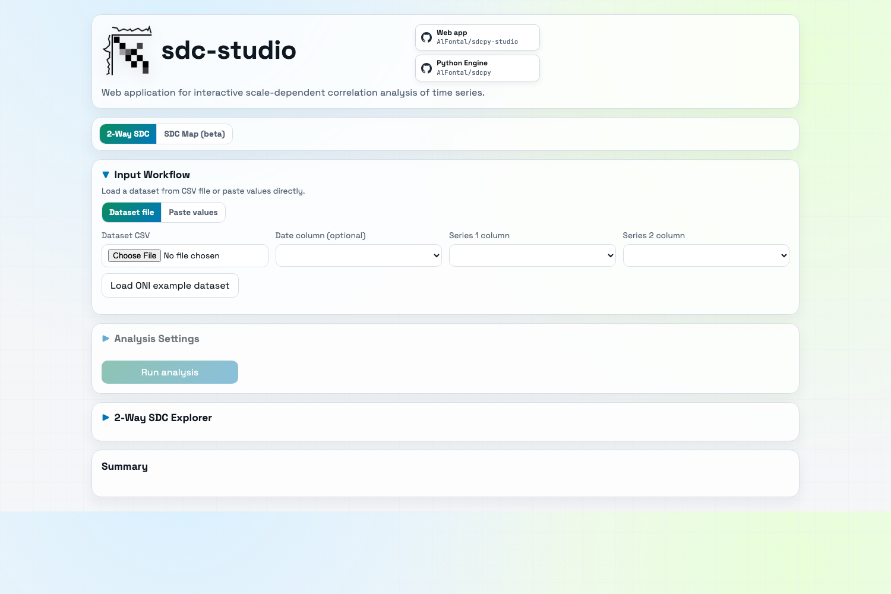
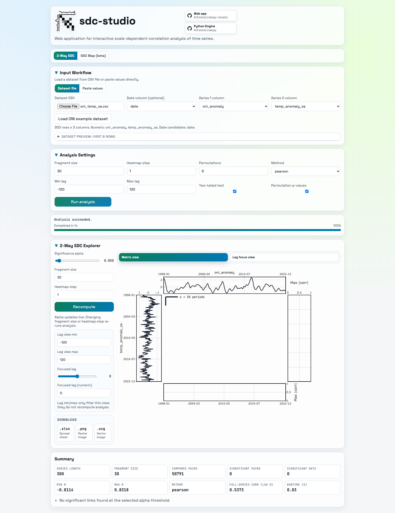
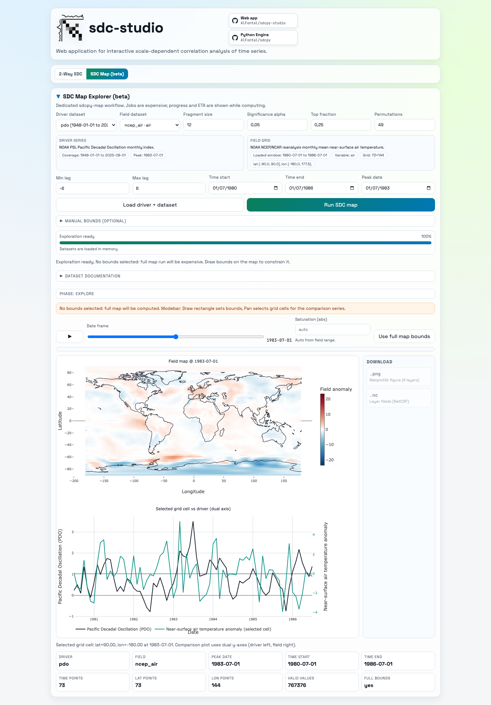

# sdcpy-studio
[](https://www.python.org/)

[](https://github.com/AlFontal/sdcpy-studio)
[](https://github.com/AlFontal/sdcpy)
[](https://github.com/AlFontal/sdcpy-map)

`sdcpy-studio` is a web app for interactive scale-dependent correlation analysis of time series.

It offers two workflows:
- `2-Way SDC`: fast exploratory correlation analysis for paired time series.
- `SDC Map (beta)`: map-based exploration and SDC map computation over gridded fields.

## Visual Tour
### Home and main workflow


### 2-Way Explorer (ONI example after run)


### SDC Map exploration


## Quick Start (Local)
### 1) Install dependencies
```bash
git clone https://github.com/AlFontal/sdcpy-studio.git
cd sdcpy-studio
uv sync --extra dev --extra map
```

### 2) Run the app
```bash
npm run dev:api
```

Open: `http://127.0.0.1:8000`

## Docker Compose Deployment
`docker-compose.yml` is the easiest way to deploy and keep a persistent dataset cache.

### Start / update
```bash
docker compose up -d --build
```

Open: `http://127.0.0.1:8050`

### Prewarm map datasets (recommended)
```bash
docker compose --profile tools run --rm cache-map
```

### Stop
```bash
docker compose down
```

### Stop + remove cache volume
```bash
docker compose down -v
```

## What You Can Do
- Upload CSV data or paste two series directly.
- Run asynchronous analysis and monitor progress.
- Explore 2-way SDC outputs interactively.
- Use SDC Map exploration with date slider, map bounds, and grid-cell comparison.
- Download outputs for reports and sharing.

## Tech Stack
- FastAPI backend
- Vanilla JS + Plotly frontend
- `sdcpy` and `sdcpy-map` computational engines
- `uv` for dependency management

## Development
```bash
uv sync --extra dev --extra map
ruff check .
uv run pytest -q
npm run test:e2e:with-api
```

## CI and Merge Protection
- CI runs on every PR to `main` and on pushes to `main` via `.github/workflows/ci.yml`.
- The workflow runs:
  - `uv run pytest -q tests/test_api.py`
  - `npm run test:e2e:with-api`
- Recommended repository setting:
  - enable branch protection for `main`
  - require status checks to pass before merging
  - select required check: `CI / tests`

## License
MIT
