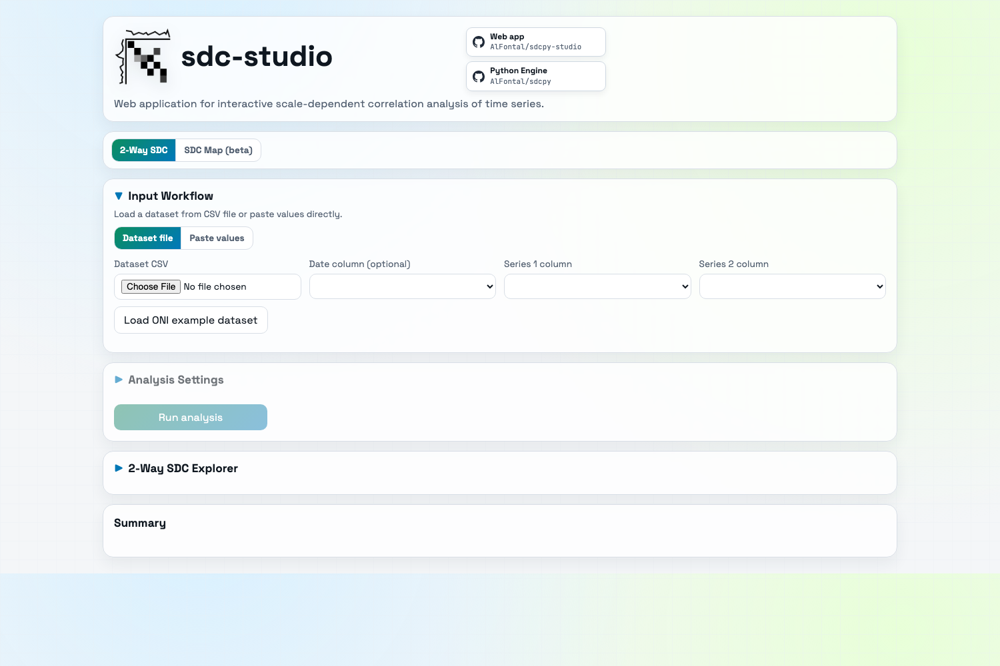
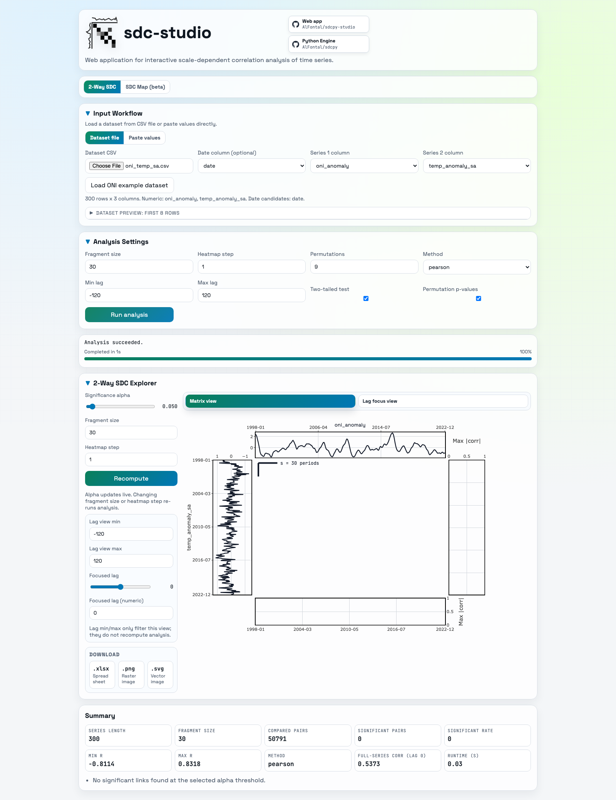
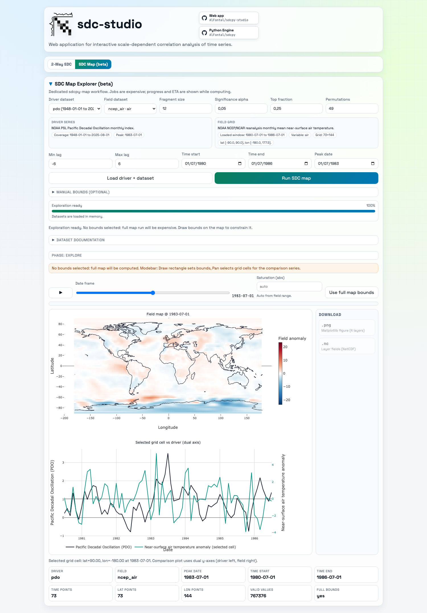

# sdcpy-studio
[](https://www.python.org/)

[](https://github.com/AlFontal/sdcpy-studio)
[](https://github.com/AlFontal/sdcpy)
[](https://github.com/AlFontal/sdcpy-map)

`sdcpy-studio` is a web application for exploring transient, lagged, and event-conditioned relationships in time series and gridded data.

It is designed for people who want to use the methods through an interface, not only as a Python library.

The app offers two workflows:

- `2-Way SDC`, for comparing two time series locally through time
- `SDC Map`, for finding where a scalar driver is expressed across a spatial field

## What You Can Do

- paste or upload two time series and run `2-Way SDC`
- upload a custom driver `CSV`
- upload a custom field `NetCDF`
- explore positive and negative event classes separately in `SDC Map`
- inspect detected driver events before launching a map
- work with catalog datasets or your own uploaded data
- download figures and outputs for reporting

## Visual Tour

### Home and main workflow


### 2-Way Explorer


### SDC Map exploration


## Which Workflow Should I Use?

### Use `2-Way SDC` if:

- you want to compare two time series directly
- you expect the relationship to be intermittent
- you want to examine local coupling through time and lag

### Use `SDC Map` if:

- you have one scalar driver and one gridded field
- you want to study the spatial response to selected events
- you need separate positive-event and negative-event maps

## How the App Thinks About the Analysis

The app is built around one core idea: a single full-record correlation can hide the real structure of a relationship.

Instead, the workflows focus on:

- local windows rather than only full-series summaries
- lagged responses rather than only simultaneous behavior
- event-conditioned responses rather than only global averages

For a user-facing explanation of the methodology, see [docs/sdc_explained.md](docs/sdc_explained.md).

## Quick Start

### Run locally from source

```bash
git clone https://github.com/AlFontal/sdcpy-studio.git
cd sdcpy-studio
uv sync --extra dev
npm run dev:api
```

Then open:

```text
http://127.0.0.1:8000
```

Map support is bundled in the main install, including the NetCDF dependencies needed for custom field uploads.

## Docker Deployment

The default deployment path is Docker-first.

### 1. Pull the image

```bash
docker pull ghcr.io/alfontal/sdcpy-studio:latest
```

### 2. Download the compose file

```bash
curl -O https://raw.githubusercontent.com/AlFontal/sdcpy-studio/main/docker-compose.yml
```

### 3. Start the app

```bash
docker compose up -d
```

Then open:

```text
http://127.0.0.1:8050
```

## First-Run Cache Warmup

On first boot, the app starts immediately and warms the bundled SDC Map catalog cache in the background.

That means:

- `2-Way SDC` is available immediately
- custom uploaded SDC Map inputs are available immediately
- catalog-backed SDC Map datasets may be slower until warmup finishes

The cache is stored in the named Docker volume `sdcpy_map_cache`.

You can inspect warmup status with:

```bash
curl http://127.0.0.1:8050/health
```

Example response:

```json
{
  "status": "ok",
  "map_cache": {
    "status": "warming"
  }
}
```

### Warmup modes

Default behavior:

```bash
SDCPY_STUDIO_MAP_PREWARM_MODE=auto
```

Supported modes:

- `auto`: warm the catalog cache on startup if needed
- `off`: disable startup warmup
- `force`: rebuild the catalog cache on every startup

Example:

```bash
SDCPY_STUDIO_MAP_PREWARM_MODE=force docker compose up -d
```

### Optional manual prewarm

If you want to warm the catalog cache before users hit the app:

```bash
docker compose --profile tools run --rm cache-map
```

## Automatic Updates and Log Access

### Automatic image updates

If you want the server to keep tracking `ghcr.io/alfontal/sdcpy-studio:latest` automatically:

```bash
docker compose --profile ops up -d
```

This starts `watchtower`, which checks for newer images and recreates the app container automatically.

If you prefer manual updates:

```bash
docker compose pull
docker compose up -d
```

### Browser log viewer

The same `ops` profile also starts `Dozzle`, a simple web UI for Docker logs.

Start it with:

```bash
docker compose --profile ops up -d
```

Then open:

```text
http://YOUR_SERVER:8051
```

CLI alternatives:

```bash
docker compose logs -f
docker compose logs -f sdcpy-studio
docker compose logs --since=30m sdcpy-studio
```

## A Typical User Workflow

### 1. Start with `2-Way SDC`

Use it to understand whether the two series show local, lagged, or intermittent coupling at all.

### 2. Move to `SDC Map`

Once the question becomes spatial, use the map workflow to detect positive and negative driver events and inspect the event preview before running the map.

### 3. Compare event classes separately

The positive and negative event classes are intentionally separated. Do not assume the two outputs should match.

### 4. Read the static and dynamic map outputs together

The app gives you:

- static `A/B/C/D` summary maps
- a dynamic lag explorer

Use the static maps for a compact overview and the lag explorer to inspect how the response evolves across lag.

## Custom Data

You can use the app with your own inputs:

- driver files as `CSV`
- field files as `NetCDF`

The upload-inspection step checks the structure of the files before the run so the app can tell you:

- whether the date/time axis is usable
- which numeric driver series was selected
- which field variables are compatible
- whether an extra dimension such as `level` needs to be selected

For field uploads, the file must contain a real dated time series. Monthly climatology files with 12 month-of-year bins, such as NOAA `*.mon.ltm.*.nc`, are not valid SDC Map inputs because they cannot be aligned to the driver time axis.

## Frontend Assets

Plotly is vendored into the image at [plotly-2.35.2.min.js](/Users/alejandro/projects/sdcpy-studio/sdcpy_studio/static/plotly-2.35.2.min.js), so deployments do not depend on an external CDN.

To upgrade Plotly:

```bash
curl -L https://cdn.plot.ly/plotly-NEW_VERSION.min.js -o sdcpy_studio/static/plotly-NEW_VERSION.min.js
```

Then:

- update the `<script>` tag in [index.html](/Users/alejandro/projects/sdcpy-studio/sdcpy_studio/templates/index.html)
- remove the older vendored file if it is no longer needed
- rerun the browser smoke tests

## For Contributors

The app is built with:

- FastAPI
- vanilla JavaScript
- Plotly
- `sdcpy`
- `sdcpy-map`
- `uv`

Development commands:

```bash
uv sync --extra dev
ruff check .
uv run pytest -q
npm run test:e2e:with-api
```

Local Docker development from source:

```bash
docker compose -f docker-compose.yml -f docker-compose.dev.yml build
docker compose -f docker-compose.yml -f docker-compose.dev.yml up -d
```

## License

MIT
